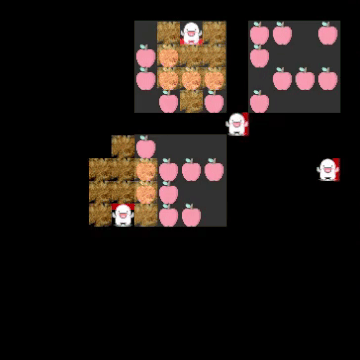
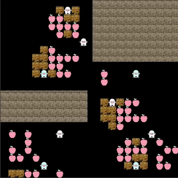

# The-Tragedy-of-the-commons
This repo is implementation of environment in paper 'Social diversity and social preferences in mixed-motive reinforcement learning'

<p float="left">


</p>

## Environment Specification
### Settings
Placeholder

### Observation
Placeholder

### Action

## Preliminaries
### Using Dockerfile
```bash
docker build  -t tocenv .
```
### Using Anaconda
```bash
conda create -n tocenv python=3.7
activate tocenv
pip install -r requirements.txt
```


## Experiment
### Train Roll-out Agents
```bash
python train.py --multirun \
      env=5b5r_rs4ro0_pc4pd8,5b5r_rs3ro1_pc4pd8,5b5r_rs2ro2_pc4pd8 \
      agent=a2ccpc \
      save_model=true
```
This command with train your A2C-CPC agents on these reward settings
- Motivated reward - 4, Un-motivated reward - 0
- Motivated reward - 3, Un-motivated reward - 1
- Motivated reward - 2, Un-motivated reward - 2

The model files with save in your `multirun/{seq}/models` directory. The `{seq}` will be running sequence of defined on your parameter.  
You also check training status with your tensorboard file in `multirun/{seq}/tb` directory.

### Info

#### Agents
##### Directions
Which directions the agents are looking for  

WIP

## Example
```python
agents_types = ['red', 'blue', 'red']
env = TOCEnv(agents=agents_types,
             map_size=(16, 16),
             obs_type='rgb_array',
             apple_color_ratio=0.5,
             apple_spawn_ratio=0.1,
             )

obs, info = env.reset()

print(obs.shape)
# (4, 11, 11)
print(info)
# ['red', 'blue', 'red']

actions = [action_1, action_2, action_3 ... action_n]
obs, reward, info = env.step(actions)
```
### Environment Parameters
`num_agents (int)` Total count of agents in the map  
`blue_agents (int)` Count of blue agents  
`red_agents (int)` Count of red agents  
`obs_type (numeric|rgb_array)` Returning state type  
`apple_color_ratio (float)` Spawn ratio of blue apple (e.g., 0.3)  
`apple_spawn_ratio (float)` Spawn speed of apples (e.g., 0.4)

## TODO
### Environment
- [X] Reset map on there's no apple one the map
- [X] Add environment parameter for `episode_max_length`
- [ ] Generate patch spawn area follow some distribution
- [X] Re-spawn apples following quantity of surrounding apples
- [X] Return agent's individual views on `step` called
- [X] Implement Agent's direction and make it available when action called on `step`
- [X] Implement action `Punish`

### Algorithms
- [X] Make CPC agent
- [X] Make CPC Module
- [ ] Debug and Train CPC
- [X] Rule-Based Agent 
- [ ] Add GPU option
- [ ] Save Model
